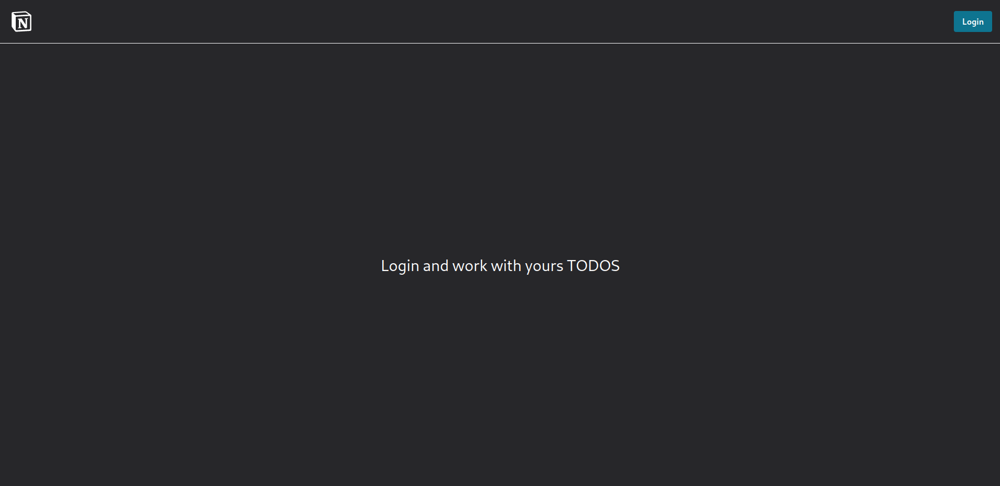
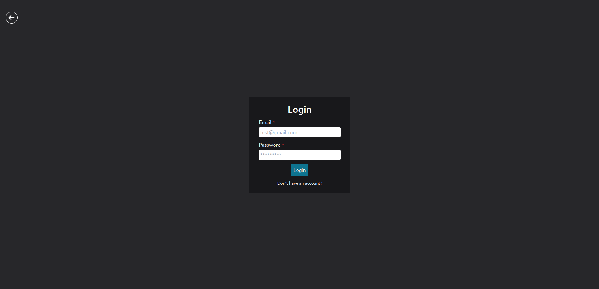
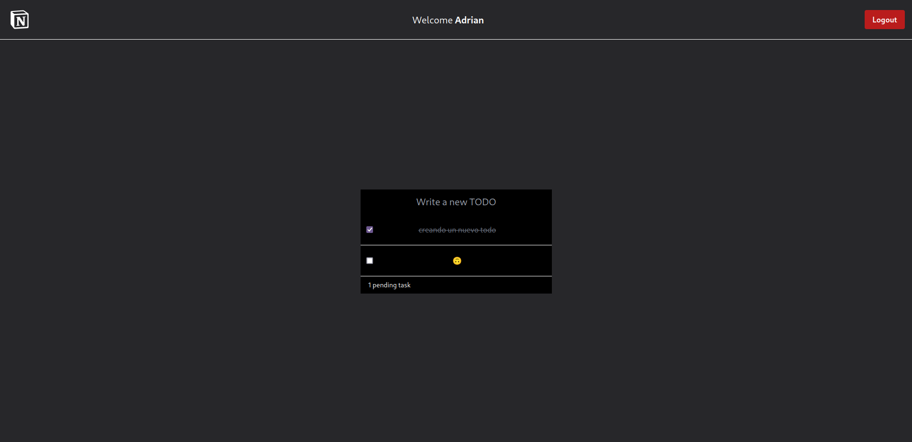

# Todo-app

Basic todo application. I created this app for improve my skills and learn Zustand.

## Preview

# Backend

## Frontend

## License

MIT License

You can create your own todo-app by forking this project with this conditions:
  * Add a link to my [portfolio](https://arnaizdev.com)
  
Check out [License](./License.md) for more detail

## Next features

- [ ] Updated TODO ?
- [ ] User delete ???
- [ ] User update ???
